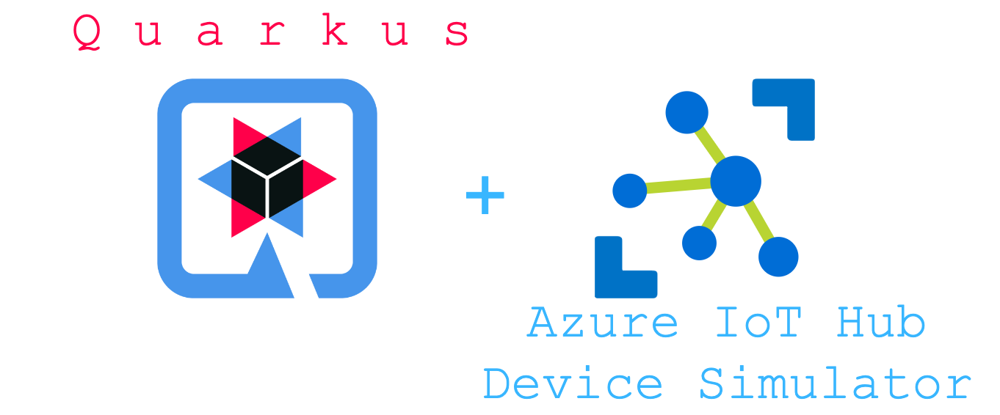
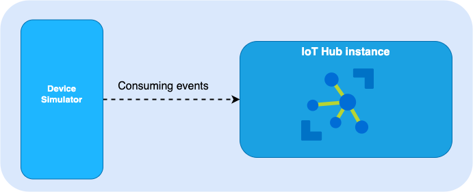

# Quarkus + Azure IoT Hub - device simulator


# IoT Hub

There are two types of categories developed for Azure SDK
 - IoT Hub Service SDK
 - IoT Hub Device SDK

The following context will be for Device SDK. 

# Consume Events from IoT Hub - device

In order to consume events from IoT Hub using the SDK the developer must define two variables.

- Each type of Protocol is required. (in the example we used MQTT)
- The device Connection String. (this is unique per device)

In the code the developer must add the proper value CONNECTION_STRING and then run the application



## Run application locally

To run your application you must run the following command:
```shell script
mvn quarkus:dev
```
